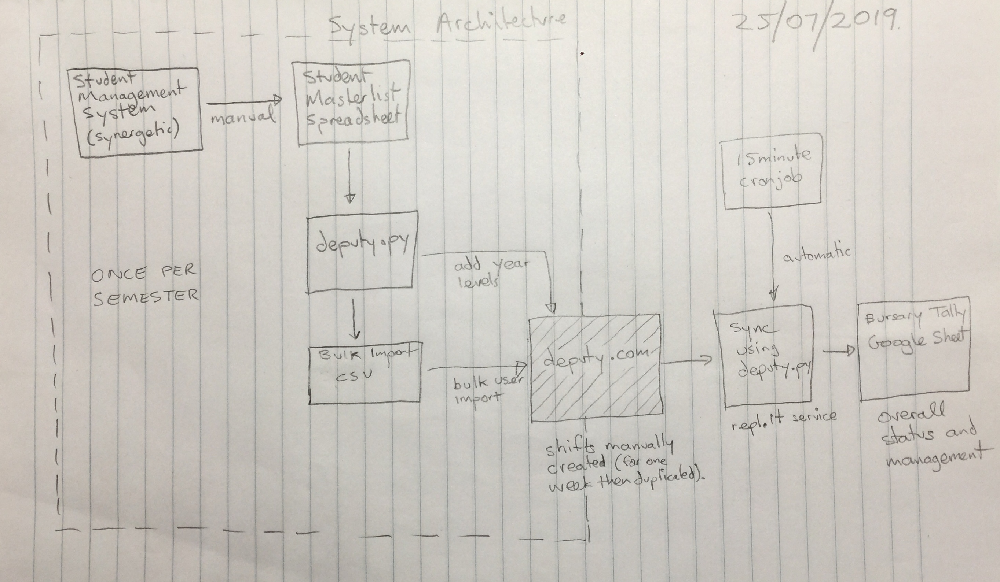

# [Deputy](https://www.deputy.com/features)
Reporting and Utility script using the [deputy.com](https://www.deputy.com) [API](https://api-doc.deputy.com/API/Getting_Started).

## Introduction

These script is used by an educational institution where around 250 residental students are required to work in the kitchen on 'Bursary' shifts. The functionality is focussed on the need to manage and report on these students.

* `deputy.py` Python3 script contains examples on how to invoke the API's.
* `explore.py` Python3 script allows Deputy records related to an employee to be listed to help understand some of the Deputy data model.

### Architecture and Process

The following diagram shows how the script is used in pactice.



## Setup

#### Minimal Configuration
You need a configuration file called `deputy.config` (in the current directory) that contains at least:

```
[DEPUTY]
api_endpoint  = https://xxx.au.deputy.com/api/v1/
access_token  = xxxxxxxxxxxxxxxxxxxxxxxxxxxxxxxx
```
The `api_endpoint` is your normal Deputy url with `/api/v1` appended.

To create your token, create a service account as a Systems Administrator, logon as that user, then get a Permanent Token using the instructions [here](http://api-doc.deputy.com/API/Authentication).

Copy the value to `access_token`.

#### Configuration

[deputy.config](deptuty.config) shows all available configuration options.

You can view the configuration (and test correct authorisation) by running the script in the same folder as the configuration file:
```
python3 deputy.py config
```
The first line shows the API version and account associated with the provided credentials (from the `me` API call).
```
DeputyVersion: 3.0.1 running as Service Account For API.
```

## Commands (deputy.py)

|Command|Purpose|Options|
|-------|-------|-------|
|`intro` (and default command)|Helpful documentation, i.e. directs users to this page!||
|`config`|List the contents of the configuration file (usually just a test to see if the config file can be read)||
|`list`|For all Active employee's, show alphabetically: Name, Year and Email. Year will be blank if Training doesn't contain Year1, Year2 or Year3.|`--csv` output CSV to stdout|
|`report`|List users alphabetically, showing all or some of 'Name', 'Year', 'Obligation', 'Rostered', 'Open', 'Completed', '% Rostered', '% Completed', 'Timesheets', 'Issues'|`--csv` output CSV to stdout; `--mobile` include a mobile phone number in the output CSV file.|
|`sync`|Synchronise Deputy user timesheet and shift data with a Google Sheet. Used in conjunction with [repl.it](https://repl.it)||
|`journal`|List all journal entries.|`--csv` output CSV to stdout|
|`user-csv`|Read from `import_csv` and write to `deputy.csv` in the correct format to allow bulk People creation.||
|`delete-users`|Delete users who are not in `import_csv` by setting `active = False`.||
|`delete-123-users`|Remove all users with a training record that includes Year1/2/3/1NR.||
|`reinstate-users`|Reinstate previously discarded students in import_csv.||
|`add-year`|Extract the year level from `import_csv` and add or update (if an old value is in Deputy) as a training record.||
|`api`|`GET` an API and display the JSON result. Limitted to 500 results.|`--api`. The default is `me`. |
|`resource`|`GET` a resource API and display the JSON result. All resource results are returned.|`--resource`. The default is `Employee`. |
|`rd`|`GET` a resource API within the `start` and `end` dates and display the JSON result. All matching resource results are returned. This will generate a bad request if `Date` is not a valid field.|`--resource`. The default is `Employee`. |
|`rc`|`GET` a resource API with the creation date between the `start` and `end` dates and display the JSON result. All matching resource results are returned. This will generate a bad request if `Date` is not a valid field.|`--resource`. The default is `Employee`. |
|`test`|Will execute the last test code I used. NOT RECOMMENDED unless you are playing with code!||

### Notes

1 Phone numbers are no longer added for user-csv because SMS messages cost too much for 300 students.

## Examples (deputy.py)

The following example (which lists all employees) assumes that the latest version is always fetched from GitHub, which is useful in an environment where you want everyone to always use the latest version of the script. I encourage you to view the script [deputy.py](deputy.py) before you run it using curl.
```
curl -s -H "Cache-control: no-cache" https://raw.githubusercontent.com/tonyallan/deputy/master/deputy.py | python3 - list
```

On a Mac, list employee's and show the CSV results in your default spreadsheet program (assuming a local copy):
```
python3 deputy.py list --csv > /tmp/z.csv && open /tmp/z.csv
```

Other examples.

```
python3 deputy.py resource 
```

```
python3 deputy.py api --api resource/Employee/1 
```

Call an API. Maximum of 500 results returned.
```
python3 deputy.py api --api resource/Roster
500 Resource records returned.
```

Get a resource. All results returned. Uses the `QUERY` API feature.
```
python3 deputy.py resource --resource Roster
1862 Resource records returned.
```

## Explore (explore.py)

The explore script searches through selected resources and displays records where all or a selected `EmployeeId` match the requested id.

For help:

```
python3 explore.py --help
```

To list all employee's:

```
python3 explore.py --list
```

To list all records for a particular employee (use their id from the Employee list):

```
python3 explore.py -i 1
```

To list all records for all employee's:

```
python3 explore.py
```

The format of the output is:
```
[resource:resource_id] field_in_record: employee_display_name (employee_id)
```

For example:
```
[Schedule:221] Creator: John Smith (1)
```

There are `start_date` and `end_date` configuration parameters and `--start` and `--end` command line parameters to select the `report` and `journal` commands.
